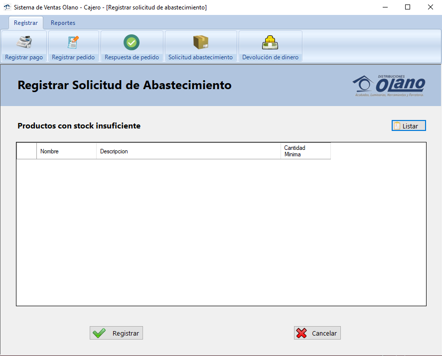

# Sistema de ventas para Olano – CSharp GUI y SQLServer
Sistema de ventas para la empresa Olano en lenguaje CSharp y base de datos SQLServer, Proyecto del **sexto semestre** de estudios de Ingeniería Informática en el curso Ingeniería de la Información II, presentado el **26/11/20**.

<strong>Imagen:</strong> GUI de Inicio de sesión.

## Uso
1. [**Interfaz Administrador**](#interfaz-administrador)
   - [**Registros administrador**](#registros-administrador)
    - [**Gestión de producto**](#gestión-de-producto)
    - [**Gestión de trabajador**](#gestión-de-trabajador)
   - [**Reportes administrador**](#reportes-administrador)
2. [**Interfaz Vendedor**](#interfaz-vendedir)
   - [**Regitrar**](#registrar)
   - [**Cuenta**](#cuenta)
3. [**Interfaz Cajero**](#interfaz-cajero)
   - [**Regitrar**](#registrar)
   - [**Reportes**](#reportes)
4. [**Interfaz Encargado de Almacén**](#interfaz-encargador-de-almacén)
   - [**Regitrar**](#registrar)
   - [**Reportes**](#reportes)

## Interfaz Administrador

### Registros administrador

<strong>Imagen:</strong> Menú de registros.

#### Getión de producto

<strong>Imagen:</strong> Gestión de producto.

#### Gestión de trabajador

<strong>Imagen:</strong> Gestión de trabajador.

### Reportes administrador

<strong>Imagen:</strong> Menú de reportes.

## Interfaz Vendedor

### Registros vendedor

<strong>Imagen:</strong> Menú de registros.

#### Registro de venta

<strong>Imagen:</strong> Registro de venta.

### Cuenta vendedor

<strong>Imagen:</strong> Menú de cuenta.

## Interfaz Cajero

### Registrar

<strong>Imagen:</strong> Menú de registros.

#### Registro de pago

<strong>Imagen:</strong> Registro de pago.

#### Registro de pedido

<strong>Imagen:</strong> Registro de pedido.

#### Registro de respuesta de pedido

<strong>Imagen:</strong> Registro de respuesta de pedido.

#### Registro de solicitud de abastecimiento

<strong>Imagen:</strong> Registro de solicitud de abastecimiento.

#### Registro de devolución de dinero

<strong>Imagen:</strong> Registro de devolución de dinero.

### Reportes

<strong>Imagen:</strong> Menú de reportes.

## Interfaz Encargado de Almacén

### Registrar

<strong>Imagen:</strong> Menú de registros.

#### Registro de entrega

<strong>Imagen:</strong> Registro de entrega.

#### Registro de producto

<strong>Imagen:</strong> Registro de producto.

#### Modificar stock de producto

<strong>Imagen:</strong> Modificar stock de producto.

#### Registro de producto defectuoso

<strong>Imagen:</strong> Registro de producto defectuoso.

### Reportes

<strong>Imagen:</strong> Menú de reportes.

